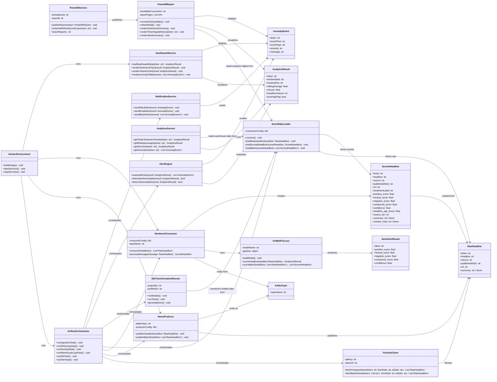

```mermaid
classDiagram

direction LR

class FinnhubClient {
  -apiKey: str
  -baseUrl: str
  +fetchCompanyNews(ticker: str, fromDate: str, toDate: str) List~RawHeadline~
  +fetchBatchNews(tickers: List~str~, fromDate: str, toDate: str) List~RawHeadline~
}

class NewsProducer {
  -kafkaTopic: str
  -producerConfig: dict
  +publishHeadline(headline: RawHeadline) void
  +publishBatch(headlines: List~RawHeadline~) void
}

class KafkaTopic {
  +topicName: str
}

class SentimentConsumer {
  -consumerConfig: dict
  -topicName: str
  +consumeHeadlines() List~RawHeadline~
  +processMessage(message: RawHeadline) ScoredHeadline
}

class FinBERTScorer {
  -modelName: str
  -pipeline: object
  +loadModel() void
  +scoreHeadline(headline:RawHeadline) SentimentResult
  +scoreBatch(headlines: List~RawHeadline~) List~ScoredHeadline~
}

class SnowflakeLoader {
  -connectionConfig: dict
  +connect() void
  +loadRawHeadline(headline: RawHeadline) void
  +loadScoredHeadline(scoredHeadline: ScoredHeadline) void
  +loadBatch(scoredHeadlines: List~ScoredHeadline~) void
}

class DbtTransformationRunner {
  -projectDir: str
  -profilesDir: str
  +runModels() void
  +runTests() void
  +generateDocs() void
}

class AnalyticsService {
  +getTickerSentimentTrends(ticker: str) AnalyticsResult
  +getRollingAverages(ticker: str) AnalyticsResult
  +getZScores(ticker: str) AnalyticsResult
  +getAnomalies(ticker: str) List~AnomalyEvent~
}

class AlertEngine {
  +evaluateRules(result: AnalyticsResult) List~AnomalyEvent~
  +detectSentimentSpike(result: AnalyticsResult) bool
  +detectVolumeSpike(result: AnalyticsResult) bool
}

class NotificationService {
  +sendSlackAlert(event: AnomalyEvent) void
  +sendEmailAlert(event: AnomalyEvent) void
  +sendBatchAlerts(events: List~AnomalyEvent~) void
}

class DashboardService {
  +loadDashboardData(ticker: str) AnalyticsResult
  +renderSentimentChart(result: AnalyticsResult) void
  +renderVolumeChart(result: AnalyticsResult) void
  +renderAnomalyTable(events: List~AnomalyEvent~) void
}

class PowerBIReport {
  -snowflakeConnection: str
  -reportPages: List~str~
  +connectToSnowflake() void
  +refreshData() void
  +renderSentimentOverview() void
  +renderTickerSignalHistory(ticker: str) void
  +renderAlertSummary() void
}

class PowerBIService {
  -workspaceId: str
  -reportId: str
  +publishReport(report: PowerBIReport) void
  +scheduleRefresh(cronExpression: str) void
  +shareReport() str
}

class AirflowOrchestrator {
  +runIngestionTask() void
  +runStreamingTask() void
  +runScoringTask() void
  +runWarehouseLoadTask() void
  +runDbtTask() void
  +runAlertTask() void
}

class DockerEnvironment {
  +buildImage() void
  +startServices() void
  +stopServices() void
}

class RawHeadline {
  +ticker: str
  +headline: str
  +source: str
  +publishedAtUtc: str
  +url: str
  +summary: str | None 
}

class SentimentResult {
  +label: str
  +positive_score: float      
  +neutral_score: float       
  +negative_score: float      
  +compound_score: float      
  +confidence: float          
}


class ScoredHeadline {
  +ticker: str
  +headline: str
  +source: str
  +publishedAtUtc: str
  +url: str
  +sentimentLabel: str
  +positive_score: float
  +neutral_score: float
  +negative_score: float
  +compound_score: float
  +confidence: float
  +headline_age_hours: float
  +source_tier: int
  +summary: str | None
  +content_hash: str | None
}

class AnalyticsResult {
  +ticker: str
  +windowStart: str
  +windowEnd: str
  +rollingAverage: float
  +zScore: float
  +headlineVolume: int
  +anomalyFlag: bool
}

class AnomalyEvent {
  +ticker: str
  +eventTime: str
  +eventType: str
  +severity: str
  +message: str
}

FinnhubClient --> RawHeadline : fetches
NewsProducer --> RawHeadline : publishes
NewsProducer --> KafkaTopic : writes to
SentimentConsumer --> KafkaTopic : reads from
SentimentConsumer --> FinBERTScorer : uses
FinBERTScorer --> SentimentResult : produces
SentimentConsumer --> ScoredHeadline : creates
SnowflakeLoader --> RawHeadline : stores raw
SnowflakeLoader --> ScoredHeadline : stores scored
DbtTransformationRunner --> SnowflakeLoader : transforms loaded data from
AnalyticsService --> AnalyticsResult : produces
AnalyticsService --> SnowflakeLoader : reads warehouse data from
AlertEngine --> AnalyticsResult : evaluates
AlertEngine --> AnomalyEvent : creates
NotificationService --> AnomalyEvent : sends
DashboardService --> AnalyticsResult : visualizes
DashboardService --> AnomalyEvent : displays
PowerBIReport --> SnowflakeLoader : reads analytics tables from
PowerBIReport --> AnalyticsResult : visualizes
PowerBIReport --> AnomalyEvent : displays
PowerBIService --> PowerBIReport : publishes
AirflowOrchestrator --> FinnhubClient : orchestrates
AirflowOrchestrator --> NewsProducer : orchestrates
AirflowOrchestrator --> SentimentConsumer : orchestrates
AirflowOrchestrator --> SnowflakeLoader : orchestrates
AirflowOrchestrator --> DbtTransformationRunner : orchestrates
AirflowOrchestrator --> AlertEngine : orchestrates
AirflowOrchestrator --> NotificationService : orchestrates
DockerEnvironment --> AirflowOrchestrator : runs
DockerEnvironment --> NewsProducer : runs
DockerEnvironment --> SentimentConsumer : runs
DockerEnvironment --> DashboardService : runs
ScoredHeadline --> RawHeadline : created from
```