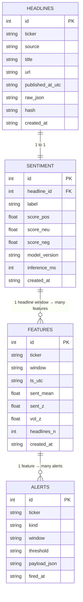

```mermaid
erDiagram

    HEADLINES {
        int id PK
        string ticker
        string source
        string title
        string url
        string published_at_utc
        string raw_json
        string hash
        string created_at
    }

    SENTIMENT {
        int id PK
        int headline_id FK
        string label
        float score_pos
        float score_neu
        float score_neg
        string model_version
        int inference_ms
        string created_at
    }

    FEATURES {
        int id PK
        string ticker
        string window
        string ts_utc
        float sent_mean
        float sent_z
        float vol_z
        int headlines_n
        string created_at
    }

    ALERTS {
        int id PK
        string ticker
        string kind
        string window
        string threshold
        string payload_json
        string fired_at
    }

    HEADLINES ||--|| SENTIMENT : "1 to 1"
    SENTIMENT ||--o{ FEATURES : "1 headline window → many features"
    FEATURES ||--o{ ALERTS : "1 feature → many alerts"
```
