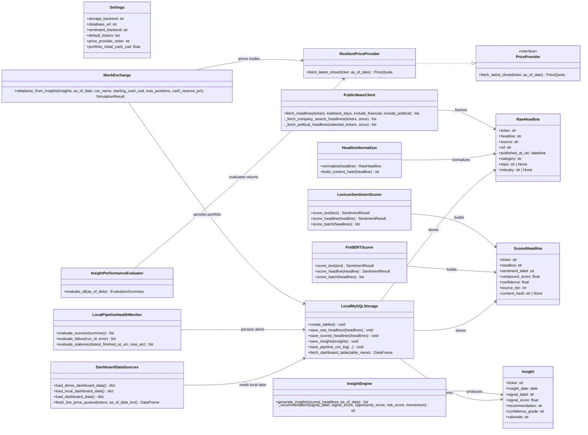

```mermaid
classDiagram
direction LR

class Settings {
  +storage_backend: str
  +database_url: str
  +sentiment_backend: str
  +default_tickers: list
  +price_provider_order: str
  +portfolio_initial_cash_cad: float
}

class RawHeadline {
  +ticker: str
  +headline: str
  +source: str
  +url: str
  +published_at_utc: datetime
  +category: str
  +topic: str | None
  +industry: str | None
}

class ScoredHeadline {
  +ticker: str
  +headline: str
  +sentiment_label: str
  +compound_score: float
  +confidence: float
  +source_tier: int
  +content_hash: str | None
}

class Insight {
  +ticker: str
  +insight_date: date
  +signal_label: str
  +signal_score: float
  +recommendation: str
  +confidence_grade: str
  +rationale: str
}

class PublicNewsClient {
  +fetch_headlines(tickers, lookback_days, include_financial, include_political) list
  -_fetch_company_search_headlines(tickers, since) list
  -_fetch_political_headlines(selected_tickers, since) list
}

class HeadlineNormalizer {
  +normalize(headline) RawHeadline
  +build_content_hash(headline) str
}

class LexiconSentimentScorer {
  +score_text(text) SentimentResult
  +score_headline(headline) SentimentResult
  +score_batch(headlines) list
}

class FinBERTScorer {
  +score_text(text) SentimentResult
  +score_headline(headline) SentimentResult
  +score_batch(headlines) list
}

class InsightEngine {
  +generate_insights(scored_headlines, as_of_date) list
  -_recommendation(signal_label, signal_score, opportunity_score, risk_score, momentum) str
}

class LocalMySQLStorage {
  +create_tables() void
  +save_raw_headlines(headlines) void
  +save_scored_headlines(headlines) void
  +save_insights(insights) void
  +save_pipeline_run_log(...) void
  +fetch_dashboard_table(table_name) DataFrame
}

class PriceProvider {
  <<interface>>
  +fetch_latest_close(ticker, as_of_date) PriceQuote
}

class ResilientPriceProvider {
  +fetch_latest_close(ticker, as_of_date) PriceQuote
}

class MockExchange {
  +rebalance_from_insights(insights, as_of_date, run_name, starting_cash_cad, max_positions, cash_reserve_pct) SimulationResult
}

class InsightPerformanceEvaluator {
  +evaluate_all(as_of_date) EvaluationSummary
}

class LocalPipelineHealthMonitor {
  +evaluate_success(summary) list
  +evaluate_failure(run_id, error) list
  +evaluate_staleness(latest_finished_at_utc, now_utc) list
}

class DashboardDataSources {
  +load_demo_dashboard_data() dict
  +load_local_dashboard_data() dict
  +load_dashboard_data() dict
  +fetch_live_price_quotes(tickers, as_of_date_text) DataFrame
}

PublicNewsClient --> RawHeadline : fetches
HeadlineNormalizer --> RawHeadline : normalizes
LexiconSentimentScorer --> ScoredHeadline : builds
FinBERTScorer --> ScoredHeadline : builds
InsightEngine --> Insight : produces
LocalMySQLStorage --> RawHeadline : stores
LocalMySQLStorage --> ScoredHeadline : stores
LocalMySQLStorage --> Insight : stores
ResilientPriceProvider ..|> PriceProvider
MockExchange --> ResilientPriceProvider : prices trades
MockExchange --> LocalMySQLStorage : persists portfolio
InsightPerformanceEvaluator --> ResilientPriceProvider : evaluates returns
LocalPipelineHealthMonitor --> LocalMySQLStorage : persists alerts
DashboardDataSources --> LocalMySQLStorage : reads local data
```
