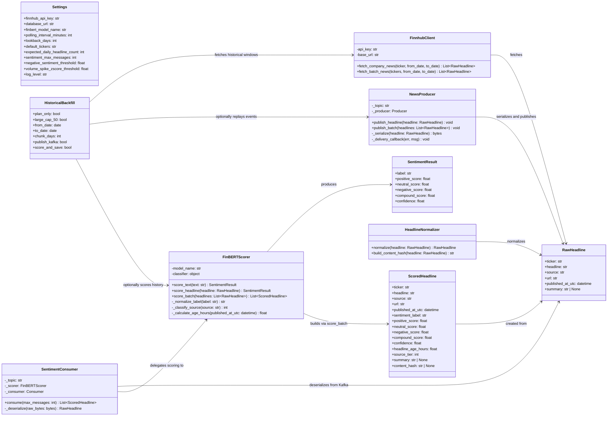

```mermaid
classDiagram

direction LR

class Settings {
  +finnhub_api_key: str
  +database_url: str
  +finbert_model_name: str
  +polling_interval_minutes: int
  +lookback_days: int
  +default_tickers: str
  +expected_daily_headline_count: int
  +sentiment_max_messages: int
  +negative_sentiment_threshold: float
  +volume_spike_zscore_threshold: float
  +log_level: str
}

class RawHeadline {
  +ticker: str
  +headline: str
  +source: str
  +url: str
  +published_at_utc: datetime
  +summary: str | None
}

class SentimentResult {
  +label: str
  +positive_score: float
  +neutral_score: float
  +negative_score: float
  +compound_score: float
  +confidence: float
}

class ScoredHeadline {
  +ticker: str
  +headline: str
  +source: str
  +url: str
  +published_at_utc: datetime
  +sentiment_label: str
  +positive_score: float
  +neutral_score: float
  +negative_score: float
  +compound_score: float
  +confidence: float
  +headline_age_hours: float
  +source_tier: int
  +summary: str | None
  +content_hash: str | None
}

class FinnhubClient {
  -api_key: str
  -base_url: str
  +fetch_company_news(ticker, from_date, to_date) List~RawHeadline~
  +fetch_batch_news(tickers, from_date, to_date) List~RawHeadline~
}

class HeadlineNormalizer {
  +normalize(headline: RawHeadline) RawHeadline
  +build_content_hash(headline: RawHeadline) str
}

class FinBERTScorer {
  -model_name: str
  -classifier: object
  +score_text(text: str) SentimentResult
  +score_headline(headline: RawHeadline) SentimentResult
  +score_batch(headlines: List~RawHeadline~) List~ScoredHeadline~
  -_normalize_label(label: str) str
  -_classify_source(source: str) int
  -_calculate_age_hours(published_at_utc: datetime) float
}

class NewsProducer {
  -_topic: str
  -_producer: Producer
  +publish_headline(headline: RawHeadline) void
  +publish_batch(headlines: List~RawHeadline~) void
  -_serialize(headline: RawHeadline) bytes
  -_delivery_callback(err, msg) void
}

class SentimentConsumer {
  -_topic: str
  -_scorer: FinBERTScorer
  -_consumer: Consumer
  +consume(max_messages: int) List~ScoredHeadline~
  -_deserialize(raw_bytes: bytes) RawHeadline
}

class HistoricalBackfill {
  +plan_only: bool
  +large_cap_50: bool
  +from_date: date
  +to_date: date
  +chunk_days: int
  +publish_kafka: bool
  +score_and_save: bool
}

FinnhubClient --> RawHeadline : fetches
HeadlineNormalizer --> RawHeadline : normalizes
NewsProducer --> RawHeadline : serializes and publishes
SentimentConsumer --> RawHeadline : deserializes from Kafka
SentimentConsumer --> FinBERTScorer : delegates scoring to
FinBERTScorer --> SentimentResult : produces
FinBERTScorer --> ScoredHeadline : builds via score_batch
ScoredHeadline --> RawHeadline : created from
HistoricalBackfill --> FinnhubClient : fetches historical windows
HistoricalBackfill --> NewsProducer : optionally replays events
HistoricalBackfill --> FinBERTScorer : optionally scores history
```
