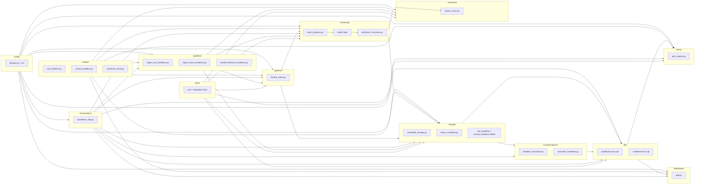

```mermaid
flowchart LR

    subgraph config["config/"]
        config_files["settings.py / .env"]
    end

    subgraph models["models/"]
        raw_headline["raw_headline.py"]
        scored_headline["scored_headline.py"]
        sentiment_result["sentiment_result.py"]
    end

    subgraph ingestion["ingestion/"]
        finnhub_client["finnhub_client.py"]
    end

    subgraph streaming["streaming/"]
        news_producer["news_producer.py"]
        sentiment_consumer["sentiment_consumer.py"]
        kafka_topic["Kafka Topic"]
    end

    subgraph sentiment["sentiment/"]
        finbert_scorer["finbert_scorer.py"]
    end

    subgraph storage["storage/"]
        snowflake_storage["snowflake_storage.py"]
        setup_snowflake["setup_snowflake.py"]
        warehouse_tables["raw_headlines / scored_headlines tables"]
    end

    subgraph transformations["transformations/"]
        headline_normalizer["headline_normalizer.py"]     
        normalize_headlines["normalize_headlines.py"]     
    end

    subgraph dbt["dbt/"]
        dbt_sources["models/sources.yml"]
        dbt_marts["models/marts/*.sql"]
    end

    subgraph alerts["alerts/"]
        alert_engine["alert_engine.py"]
    end

    subgraph dashboard["dashboard/"]
        streamlit_app["app.py"]
    end

    subgraph orchestration["orchestration/"]
        airflow_dag["quicksilver_dag.py"]
    end

    subgraph pipelines["pipelines/"]
        raw_pipeline["ingest_raw_headlines.py"]
        score_pipeline["ingest_score_headlines.py"]
        backfill_pipeline["backfill_historical_headlines.py"]
    end

    subgraph tests["tests/"]
        test_modules["unit + integration tests"]
    end

    config --> ingestion
    config --> streaming
    config --> sentiment
    config --> storage
    config --> dbt
    config --> alerts
    config --> dashboard
    config --> orchestration
    config --> pipelines

    models --> ingestion
    models --> streaming
    models --> sentiment
    models --> storage
    models --> alerts
    models --> dashboard
    models --> pipelines

    ingestion --> streaming
    news_producer --> kafka_topic
    kafka_topic --> sentiment_consumer
    sentiment_consumer --> finbert_scorer
    sentiment_consumer --> storage
    ingestion --> storage

    storage --> transformations
    storage --> dbt
    transformations --> dbt

    dbt --> alerts
    dbt --> dashboard

    orchestration --> ingestion
    orchestration --> streaming
    orchestration --> storage
    orchestration --> transformations
    orchestration --> dbt
    orchestration --> alerts
    orchestration --> dashboard
    orchestration --> pipelines

    pipelines --> ingestion
    pipelines --> streaming
    pipelines --> sentiment
    pipelines --> storage

    tests --> ingestion
    tests --> streaming
    tests --> sentiment
    tests --> storage
    tests --> dbt
    tests --> alerts
```
