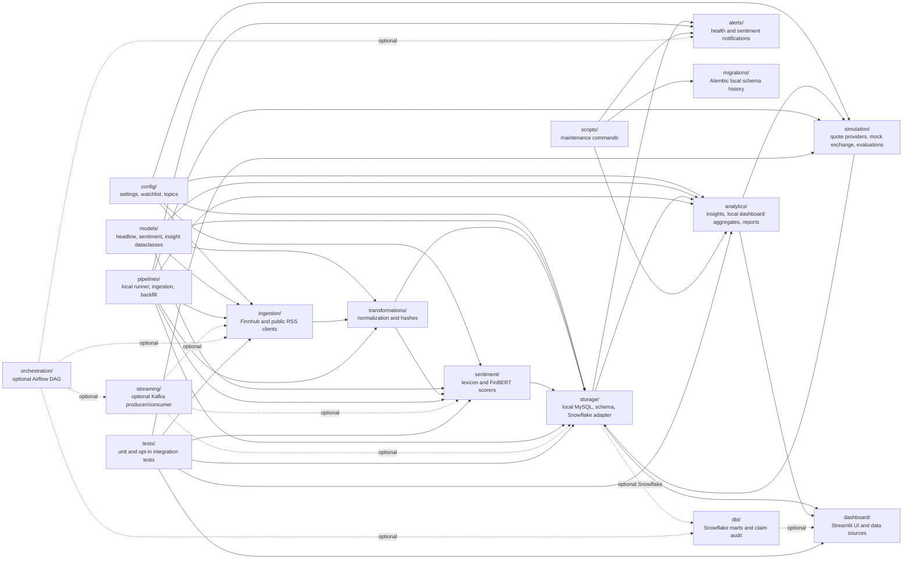

```mermaid
flowchart LR

    config["config/\nsettings, watchlist, topics"]
    models["models/\nheadline, sentiment, insight dataclasses"]
    ingestion["ingestion/\nFinnhub and public RSS clients"]
    transformations["transformations/\nnormalization and hashes"]
    sentiment["sentiment/\nlexicon and FinBERT scorers"]
    analytics["analytics/\ninsights, local dashboard aggregates, reports"]
    simulation["simulation/\nquote providers, mock exchange, evaluations"]
    storage["storage/\nlocal MySQL, schema, Snowflake adapter"]
    alerts["alerts/\nhealth and sentiment notifications"]
    dashboard["dashboard/\nStreamlit UI and data sources"]
    pipelines["pipelines/\nlocal runner, ingestion, backfill"]
    scripts["scripts/\nmaintenance commands"]
    migrations["migrations/\nAlembic local schema history"]
    dbt["dbt/\nSnowflake marts and claim audit"]
    orchestration["orchestration/\noptional Airflow DAG"]
    streaming["streaming/\noptional Kafka producer/consumer"]
    tests["tests/\nunit and opt-in integration tests"]

    config --> ingestion
    config --> sentiment
    config --> analytics
    config --> simulation
    config --> storage

    models --> ingestion
    models --> transformations
    models --> sentiment
    models --> analytics
    models --> storage

    ingestion --> transformations
    transformations --> storage
    transformations --> sentiment
    sentiment --> storage
    storage --> analytics
    analytics --> simulation
    simulation --> storage
    storage --> alerts
    storage --> dashboard
    analytics --> dashboard

    pipelines --> ingestion
    pipelines --> transformations
    pipelines --> sentiment
    pipelines --> analytics
    pipelines --> simulation
    pipelines --> alerts
    pipelines --> storage

    scripts --> migrations
    scripts --> alerts
    scripts --> analytics

    streaming -. optional .-> ingestion
    streaming -. optional .-> sentiment
    streaming -. optional .-> storage
    storage -. optional Snowflake .-> dbt
    dbt -. optional .-> dashboard
    orchestration -. optional .-> ingestion
    orchestration -. optional .-> streaming
    orchestration -. optional .-> dbt
    orchestration -. optional .-> alerts

    tests --> ingestion
    tests --> sentiment
    tests --> analytics
    tests --> simulation
    tests --> storage
    tests --> dashboard
```
