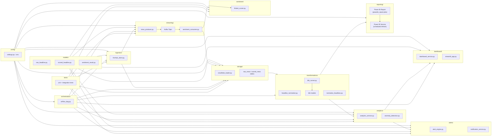

```mermaid
flowchart LR

    subgraph config["config/"]
        config_files["settings.py / .env"]
    end

    subgraph models["models/"]
        raw_headline["raw_headline.py"]
        scored_headline["scored_headline.py"]
        sentiment_result["sentiment_result.py"]
    end

    subgraph ingestion["ingestion/"]
        finnhub_client["finnhub_client.py"]
    end

    subgraph streaming["streaming/"]
        news_producer["news_producer.py"]
        sentiment_consumer["sentiment_consumer.py"]
        kafka_topic["Kafka Topic"]
    end

    subgraph sentiment["sentiment/"]
        finbert_scorer["finbert_scorer.py"]
    end

    subgraph storage["storage/"]
        snowflake_loader["snowflake_loader.py"]
        warehouse_tables["raw_news / scored_news tables"]
    end

    subgraph transformations["transformations/"]
        headline_normalizer["headline_normalizer.py"]     
        normalize_headlines["normalize_headlines.py"]     
        dbt_runner["dbt_runner.py"]                       
        dbt_models["dbt models"]                          
end

    subgraph analytics["analytics/"]
        analytics_service["analytics_service.py"]
        anomaly_detection["anomaly_detection.py"]
    end

    subgraph alerts["alerts/"]
        alert_engine["alert_engine.py"]
        notification_service["notification_service.py"]
    end

    subgraph dashboard["dashboard/"]
        dashboard_service["dashboard_service.py"]
        streamlit_app["streamlit_app.py"]
    end

    subgraph reporting["reporting/"]
        powerbi_report["Power BI Report
(powerbi_report.pbix)"]
        powerbi_service["Power BI Service
(scheduled refresh)"]
    end

    subgraph orchestration["orchestration/"]
        airflow_dag["airflow_dag.py"]
    end

    subgraph tests["tests/"]
        test_modules["unit + integration tests"]
    end

    config --> ingestion
    config --> streaming
    config --> sentiment
    config --> storage
    config --> analytics
    config --> alerts
    config --> dashboard
    config --> reporting
    config --> orchestration

    models --> ingestion
    models --> streaming
    models --> sentiment
    models --> storage
    models --> analytics
    models --> alerts
    models --> dashboard

    ingestion --> streaming
    news_producer --> kafka_topic
    kafka_topic --> sentiment_consumer
    sentiment_consumer --> finbert_scorer
    sentiment_consumer --> storage
    ingestion --> storage

    storage --> transformations
    dbt_runner --> dbt_models
    transformations --> analytics

    analytics --> alerts
    analytics --> dashboard
    transformations --> reporting
    powerbi_report --> powerbi_service

    alerts --> notification_service
    orchestration --> ingestion
    orchestration --> streaming
    orchestration --> storage
    orchestration --> transformations
    orchestration --> analytics
    orchestration --> alerts
    orchestration --> dashboard

    tests --> ingestion
    tests --> streaming
    tests --> sentiment
    tests --> storage
    tests --> analytics
    tests --> alerts
```
